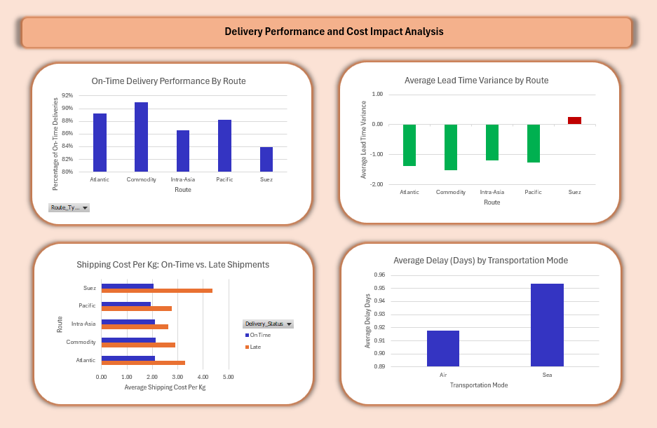
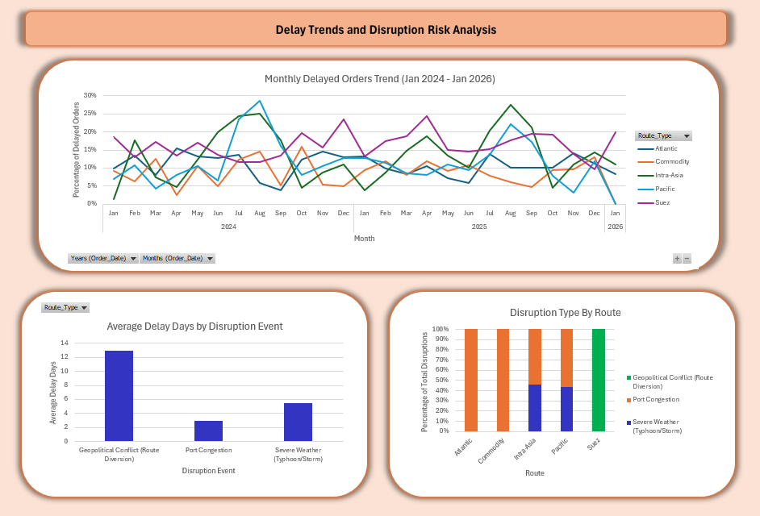

# Supply-Chain-Trade-Routes-Analysis
Global Supply Chain and Trade Route data analysis project: used Excel to analyze and visualize supply chain and trade route data.

**Project Purpose / Objective:**
- Analyzed 10K+ international shipments to identify delays, bottlenecks, and risks from port congestion, severe weather, and geopolitical events, feature-engineered metrics like Delay Flag, Lead Time Variance, and Shipping Cost per Kg, and built an interactive Excel dashboard to visualize performance and support stakeholder decisions. 

**Dashboard 1: Delivery Performance & Cost:**

**Dashboard 2: Delay Trends and Disruption Risk:**

**Dashboard Overview Snapshot:**
- On-Time Delivery Performance: Bar chart showing on-time rate by route.
- Lead Time Variance: Bar chart comparing planned vs actual delivery days.
- Shipping Cost per Kg (On-Time vs Late): Bar chart illustrating cost impact of late shipments.
- Delay by Transportation Mode: Bar chart comparing delays by air vs. sea.
- Monthly Trend of Delayed Orders: Line chart showing month-by-month delayed shipments.
- Impact of Disruption Events: Stacked chart showing delay days by type of disruption.
- Route-Specific Disruption Patterns: Bar chart highlighting routes vs disruption types.

**Key Insights for Stakeholders from Delivery Performance & Cost Dashboard:**

On-Time Delivery Performance:
- Delivery performance is different across the routes. The Commodity route has the best on-time rate at about 91%, making it the most reliable route. Atlantic follows at around 89%, and Pacific is close at about 88%. Intra-Asia performs slightly lower at 86%. Suez has the lowest on-time rate at about 84%.
- The gap between Commodity and Suez is noticeable. This shows that shipments moving through Suez are more likely to be delayed compared to the other routes.

Lead Time Variance:
- Most routes are arriving slightly earlier than planned. Commodity arrives about 1.6 days early on average. Atlantic arrives about 1.4 days early, Pacific about 1.3 days early, and Intra-Asia about 1.2 days early.
- Suez is the only route that arrives late on average. Instead of arriving early, it shows a small delay. This confirms that Suez is the weakest-performing route in terms of schedule reliability.

Shipping Cost per Kg (On-Time vs Late):
- Across every route, late shipments cost more per kilogram than shipments delivered on time.
- The biggest cost increase happens on the Suez route. Late shipments there cost around 4.3 per kg, which is the highest among all routes. Atlantic and Commodity also show clear cost increases when shipments are late. Pacific and Intra-Asia follow the same pattern, though the increase is slightly smaller.
- This shows that delays do not just affect service performance — they also increase shipping costs.

Delay by Transportation Mode:
- Sea freight has slightly higher delays than air freight. Air shipments average about 0.92 delay days, while sea shipments average about 0.95 delay days.
- The difference is small, which suggests that route-specific issues and disruption events have a bigger impact than transportation mode alone.

**Key Insights for Stakeholders from Delay Trends and Disruption Risk Dashboard:**

Monthly Trend of Delayed Orders (2024–Jan 2026):
- Looking at the monthly trends, some routes show more ups and downs than others. Intra-Asia and Pacific have the most variation in delay percentages. Commodity remains the most stable over time.
- Many routes show higher delay levels around the middle of the year, especially between July and September. There are also some increases toward the end of certain years. Suez shows repeated spikes in delays, including another increase at the start of 2026.
- This suggests there may be seasonal patterns affecting performance, such as weather or peak shipping periods.

Impact of Disruption Events:
- Different types of disruptions cause different levels of delay.
- Geopolitical conflict causes the biggest delays, averaging about 13 days. Severe weather causes around 5 to 6 days of delay. Port congestion causes about 3 days of delay on average.
- Even though port congestion may happen more often, geopolitical events create much longer delays when they occur.

Route-Specific Disruption Patterns:
- Each route is affected by different types of disruptions:
  - Atlantic and Commodity are mainly affected by port congestion.
  - Intra-Asia and Pacific are affected by both port congestion and severe weather.
  - Suez is affected entirely by geopolitical conflict.
  - This helps explain the earlier performance results. Suez has the lowest on-time rate and the highest late costs because it is exposed to the most severe type of disruption.

**Feature Engineering:**
- Created new features to enrich analysis:
  -  Shipping_Cost_Per_Kg: Cost per kilogram for each shipment, calculated to assess cost efficiency.
  -  OnTime_Flag: Binary flag indicating whether a shipment was delivered on time (1 = on time, 0 = late).
  -  Delay_Flag: Binary flag marking delayed shipments (1 = delayed, 0 = on time).
  -  LeadTime_Variance: Difference in days between planned and actual delivery, showing early or late arrivals.
  -  Used pivot tables to aggregate, summarize, and analyze performance, cost, and disruption patterns across routes and transportation modes.
  -  These features directly supported the dashboards and key insights for stakeholders.

**Dataset & Tools:**
- Dataset: Global Supply Chain and Trade Route from Kaggle
- Tools: Microsoft Excel (pivot tables) for feature engineering, analysis, and visualization

**How to Run:**
1.	Open the Excel workbook Supply Chain Analysis.xlsx.
2.	Use the included pivot tables, formulas, and charts to explore on-time performance, lead times, costs, and disruption trends.
3.	Follow the dashboard tabs to reproduce insights and visualizations.
